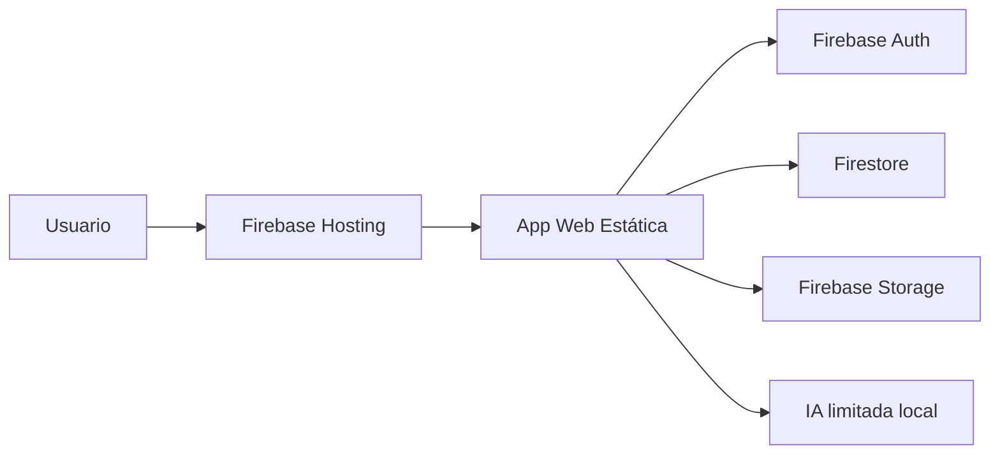

# Arquitectura final



## Decisiones

### 1. Migración a Firebase puro

- [PROPUESTA]: Eliminar Express, PostgreSQL, Drizzle y API generada. Dejar una app estática conectada directamente a Firebase Auth, Firestore y Storage.
- [PROS]: Menos puntos de fallo. Menos configuración. Despliegue directo en Firebase Hosting. Menor riesgo de pantalla blanca por API caída.
- [CONTRAS]: La lógica sensible debe protegerse con reglas de Firestore/Storage. Para IA real segura se requiere Cloud Functions después.

### 2. Firestore como base final

- [PROPUESTA]: Guardar `companies`, `documents`, `auditLogs` y `users` como colecciones raíz.
- [PROS]: Consultas simples por `ownerUid`, sincronización en tiempo real y menos configuración local.
- [CONTRAS]: Requiere índices compuestos para ordenar por fecha y filtrar por empresa.

### 3. Storage para PDF/XML

- [PROPUESTA]: Guardar binarios en `companies/{companyId}/documents/{documentId}/{fileName}`.
- [PROS]: Evita guardar archivos en Firestore. Permite URL de descarga segura y reglas por empresa.
- [CONTRAS]: Las reglas dependen de que exista la empresa en Firestore.

### 4. IA en modo limitado

- [PROPUESTA]: No usar OpenAI desde navegador. Mostrar análisis local y aviso claro.
- [PROS]: No rompe la app si falta API Key. No expone secretos.
- [CONTRAS]: No hay análisis LLM real hasta agregar Cloud Functions.

## Colecciones

```text
users/{uid}
companies/{companyId}
documents/{documentId}
auditLogs/{logId}
```

## Storage

```text
companies/{companyId}/documents/{documentId}/{fileName}
```
